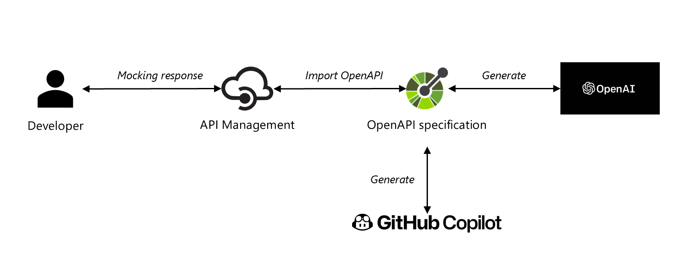
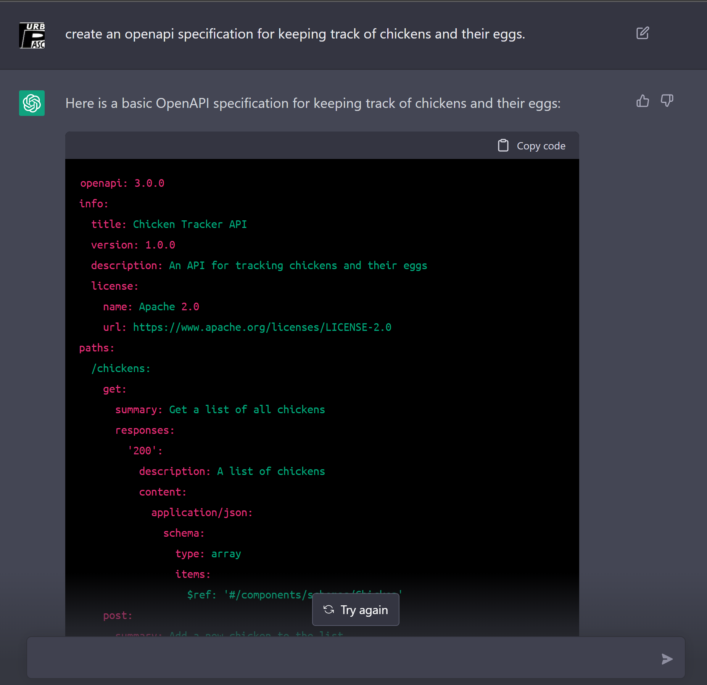

# API design with AI and mocking with Azure API Management

## Build Status

| GitHub Action | Status |
| ----------- | ----------- |
| Build | [](https://github.com/pascalvanderheiden/ais-apim-copilot/actions/workflows/build.yml) |
| Release | [](https://github.com/pascalvanderheiden/ais-apim-copilot/actions/workflows/release.yml) |

## About

I was wondering how current AI tools could help me with API Design. I was already using GitHub Copilot since the beta release, but used it mainly for bicep completion and markdown writing. In the process of creating this repo, my colleague Alexandre Vieira made me aware of the OpenAI project ChatGPT, which has become quite popular lately. I was curious to see how it would perform in comparison to GitHub Copilot.

I've created this repository to show how you can use [GitHub Copilot](https://github.com/features/copilot) to create an OpenAPI specification and deploy it to [Azure API Management](https://docs.microsoft.com/en-us/azure/api-management/overview). I've also added 2 GitHub Actions to deploy it all in an automated way.

I've used the [Bicep](https://docs.microsoft.com/en-us/azure/azure-resource-manager/bicep/overview) language to deploy the resources. I got most of my examples from [here](https://github.com/Azure/bicep/tree/main/docs/examples).

I've added mocking policies to the API, so you can test the API without having to implement the backend. Which is ideal for testing and prototyping purposes. You could consider this an API Design First approach.

I've also added a [ChatGPT](https://openai.com/blog/chatgpt/) generated OpenAPI specification to compare it with GitHub Copilot. Thanks Alexandre Vieira for the suggestion!

Hope you find this useful!

## Architecture



## Prerequisites

* Install [Visual Studio Code](https://code.visualstudio.com/download)
* Install [GitHub Copilot](https://copilot.github.com/) Extension for Visual Studio Code.
* Install [REST Client](https://marketplace.visualstudio.com/items?itemName=humao.rest-client) Extension for Visual Studio Code.
* Install [OpenAPI Editor](https://marketplace.visualstudio.com/items?itemName=42Crunch.vscode-openapi) Extension for Visual Studio Code.
* Install Chocolatey (package manager)

```ps1
Set-ExecutionPolicy Bypass -Scope Process -Force; [System.Net.ServicePointManager]::SecurityProtocol = [System.Net.ServicePointManager]::SecurityProtocol -bor 3072; iex ((New-Object System.Net.WebClient).DownloadString('https://community.chocolatey.org/install.ps1'))
```

* Install Bicep CLI

```ps1
choco install bicep
```

* Install Az Module in PowerShell

```ps1
Install-Module -Name Az -AllowClobber -Scope CurrentUser
```

## Create an OpenAPI Specification with GitHub Copilot and OpenAI ChatGPT

### Create an OpenAPI Specification with GitHub Copilot

In Visual Studio Code, open a new file and start typing...


* Delete the backend server reference from the openapi specification (when generated)

```json
"servers": [
        {
            "url": "http://localhost:5000"
        }
    ],
```

* Extending the OpenAPI Specification with GitHub Copilot
You can also use copilot to help you extend the OpenAPI Specification. For example, I asked copilot for a example response, and it automatically generated a sample response based on the schema.


If you've added the example response generated by copilot, it will automatically add the example response when adding responses to one of the other operations.

One thing that was missing in the initial generated code were the parameters, so I let Copilot generate the parameters for me.


### Create an OpenAPI Specification with ChatGPT

As a comparison I wanted to see how other generators would perform. I've used [ChatGPT](https://openai.com/blog/chatgpt/) to compare. It's free, just register and you can start using it.

* Create an OpenAPI Specification with ChatGPT



By default it generated a OpenAPI specification in YAML format, without examples. I've asked ChatGPT to generate the examples in my next ask.


Pretty impressive, but I think GitHub Copilot is still the winner. Because you can use it within Visual Studio Code, and it's easier to extend the OpenAPI Specification. But it's still a good alternative. I've also added the ChatGPT generated OpenAPI Specification to the repository.

I've saved the output [here](deploy/release/openapi/openapi_chatgpt.yaml).

Two things that I've noticed is that ChatGPT does generate the parameters in the first go, where Copilot doesn't. Second, I've noticed that when the output get very big, ChatGPT just cuts off the end. Also, the interpretation the part of "chickens and their eggs" is different, where Copilot interprets it as 2 seperate entities; chicken and egg, and ChatGPT interprets the eggs as a part of the entity chicken.

## Implement a mocking response policy

You can add a mocking response easily in a policy (see snippet below). I've added this policy in the automated deployment [here](deploy/release/policies/api_policy.xml), which will return a mocking response.

```xml
<mock-response status-code="200" content-type="application/json" />
```

## Deploy Manually

* Git Clone the repository

```ps1
git clone https://github.com/pascalvanderheiden/ais-apim-copilot.git
```

* Deploy it all by one script

I've included all the steps in 1 Powershell script. This will create all the needed resources. Keep in mind that this will take a while to deploy.

I've used these variables:

```ps1
$subscriptionId = "<subscription_id>"
$namePrefix = "<project_prefix>"

# For removing soft-delete
$apimName = "<apim_name>"
```

```ps1
.\deploy\manual-deploy.ps1 -subscriptionId $subscriptionId -namePrefix $namePrefix
```

* Remove the APIM Soft-delete

If you deleted the deployment via the Azure Portal, and you want to run this deployment again, you might run into the issue that the APIM name is still reserved because of the soft-delete feature. You can remove the soft-delete by using this script:

```ps1
.\deploy\del-soft-delete-apim.ps1 -subscriptionId $subscriptionId -apimName $apimName
```

* Testing

I've included a tests.http file with relevant Test you can perform, to check if your deployment is successful. Or you can just test it via the Azure Portal.


## Deploy with Github Actions

* Fork this repository

* Generate a Service Principal

```ps1
az ad sp create-for-rbac -n <name_sp> --role Contributor --sdk-auth --scopes /subscriptions/<subscription_id>
```

Copy the json output of this command.

* Update GitHub Secrets for customizing your deployment

In the repository go to 'Settings', on the left 'Secrets', 'Actions'.
And pass the json output in the command used above into the secret 'AZURE_CREDENTIALS'.

The following secrets need to be created:

* AZURE_CREDENTIALS
* AZURE_SUBSCRIPTION_ID
* LOCATION
* PREFIX

### Commit

Commit the changes, and this will trigger the CI Build Pipeline.
